# The rest of Maher functionalities

This page will show the rest of the functionalities that we couldn't cover in the presentation.

##### This list along with the actor who can do it

  - Create Hackathon (manager)
  - Manage Judges in the hackathon (manager)
  - Publish the hackathon (manager)
  - Sort hackathons in the search tab (participant)
  - Register in a hackathon (participant)
  - Create team (participant)
  - Invite to team (team Leader)
  - Evaluate team (reviewer)

##### List of users used in this example and their types
- Ibrahim AlSuhaim (hackathon manager)
- Fahad Alokail (reviewer)
- Mohammed Alaqil (Team leader)
- Abdullah Aljumhour (Team member)
- Yaqoob Almaamary (Team member)

### Manager and Judge view

- The manager can create a hackathon from plus sign button in the home tab.

  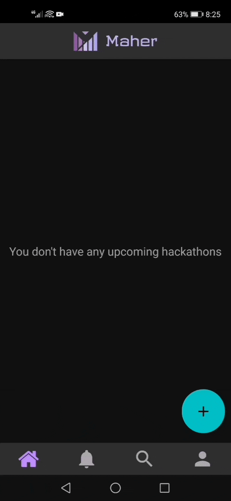

- After filling all the fields required, he hit create button and will be directed to the home tab and will see a card like this

  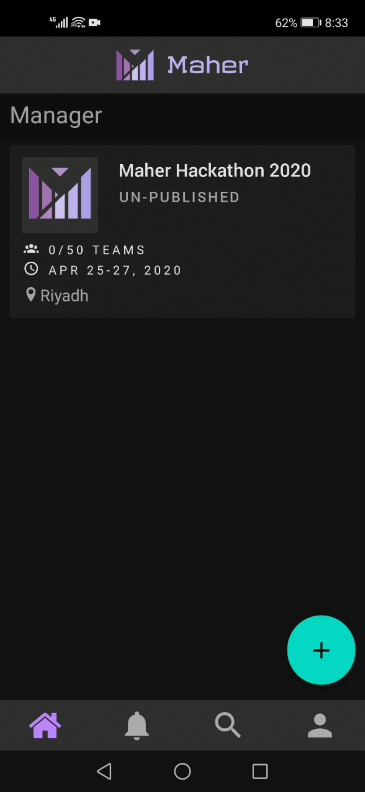

- he clicks on that card. he will be directed to the hackathon page. he can edit the hackathon or add judges (reviewers) to his hackathon. Here he want to send a request to Fahad Alokail to be one of the judges.

Ibrahim (the manager) View

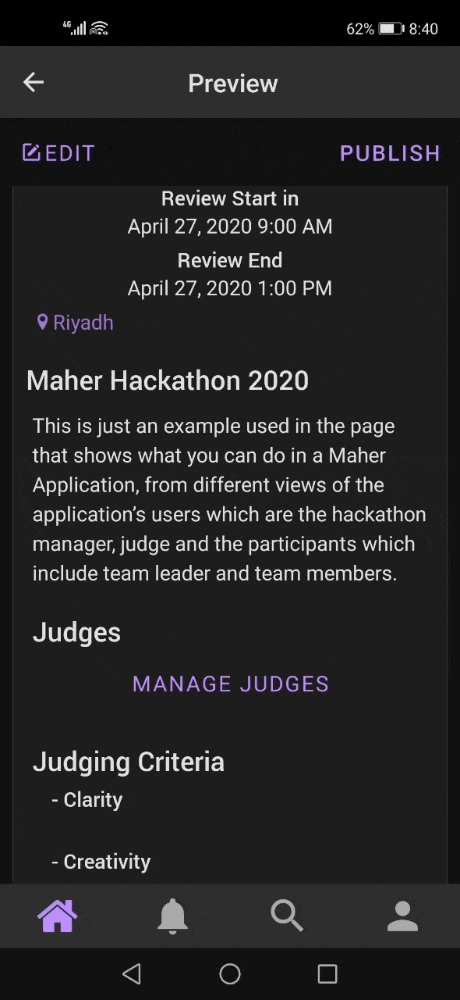

Fahad's view

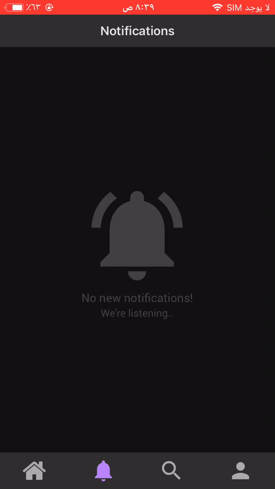

\
The manager can also:
  - Remove the judge
  - add himself to the judges list

##### Publish the hackathon
After The manager send to all the judges he want and they accept (Note: judges will not be allowed to accept the invitation once hackathon started)

- The manager clicks publish

  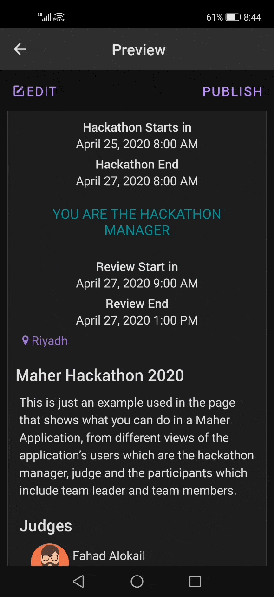

### Participant View

After publishing the hackathon now the users can see the hackathon card in the search tab.

BTW, they can sort the list of hackathons ( closest to start, most prizes, most participants)
- Sort hackathons

  

- Mohammed ( a participant ) saw the hackathon and wants to register

  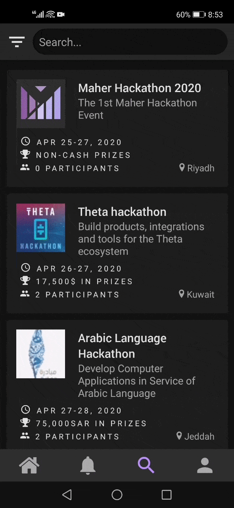

The hackathon is added in the home tab, from that he can either create a team or view teams to join.

- He wants to create a team, he clicks create team button and then will be directed to create team form. After he fills the form hits create. (now the team should be created)

  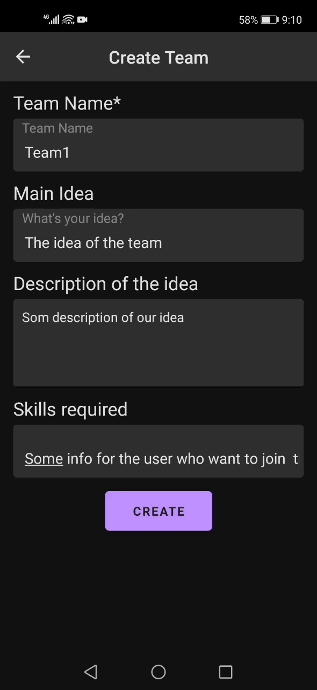

After a while, another participant ( Abdullah ) has registered to that hackathon.

Mohammed (The team leader) wants to invite Abdullah to his team (Team1)

- Mohammed clicks invite members button in the team page and sends the request to Abdullah

   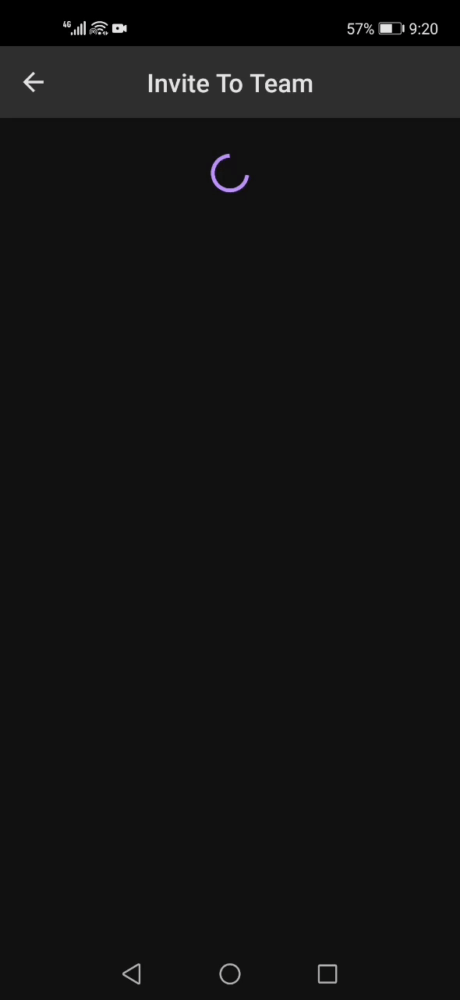

- Abdullah will see the invitation request in the notifications tab. He can accept or ignore the invitation. Suppose he accept it. After that, the team page from Mohammed's perspective look like this

  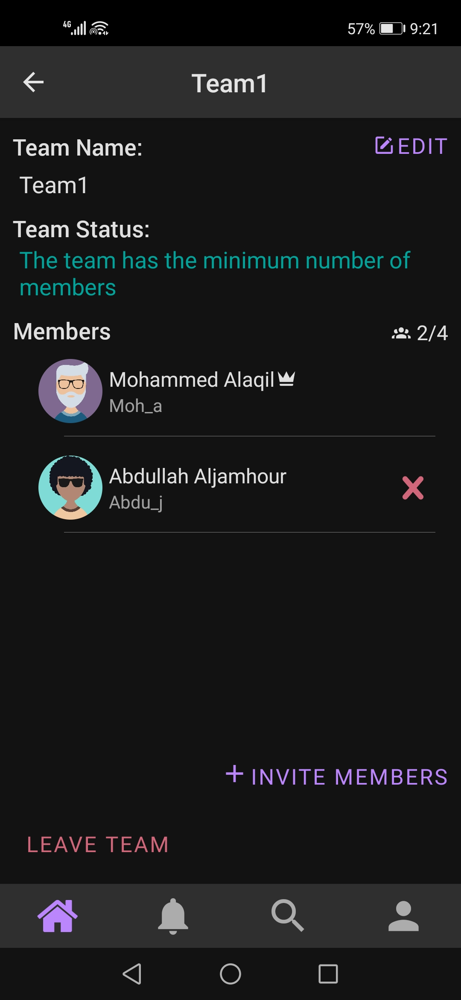

\
Now Team1 has reached the minimum number of the team and officially has been participated to Maher Hackathon  2020

### Hackathon in the Review Period

Now we will move to Fahad's screen (The reviewer or the judge). Once the review period for Maher Hackathon has started, the screen in the home tab will look like this.

  - 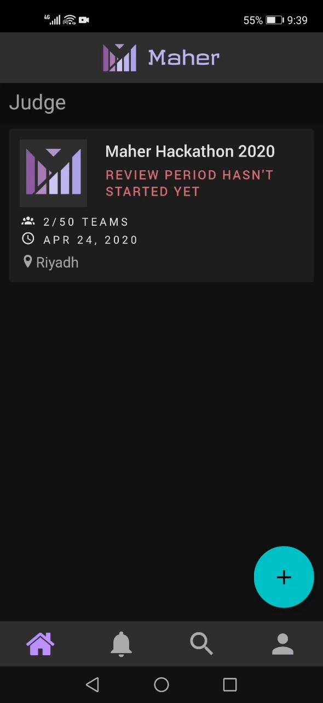

\
After starting, The reviewer can click on the evaluate button and he will be directed to a screen with a list of teams that have participated in Maher Hackathon. Then,

- He can view the profile of the team

  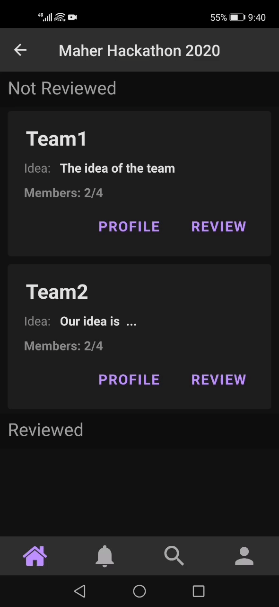

- Or clicks review. and complete the form that consists of the criteria the has initialized by the manager. Then, submit.

  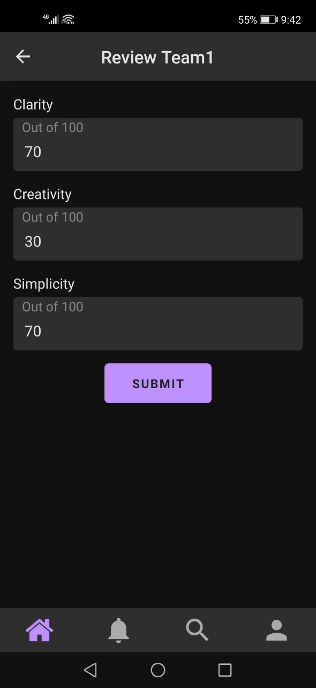

# The End

  - 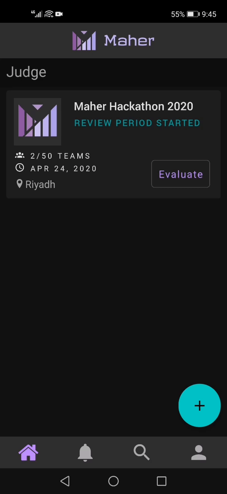

\
This is all the functionalities that we intend to cover during the presentation but we couldn't.

Okay, where is the select winner part?
Actually, we were unable to put this feature into the app because of the time. But, it will be the first feature that we will add in the future insha allah.

## Note
We are using a scheduled function with the help of [firebase cloud functions](https://firebase.google.com/docs/functions) that run to start and end the hackathon based on the dates that the manager has selected during hackathon creation.

In this example We change the dates to the current recording time directly from the database and make the scheduled function handle changing the status of the hackathon to have a real example.

So, in case you want to try to create or participate in hackathon. That hackathon will start and end based on the dates given automatically.

See [Schedule functions](https://firebase.google.com/docs/functions/schedule-functions)

Thank you for reading
